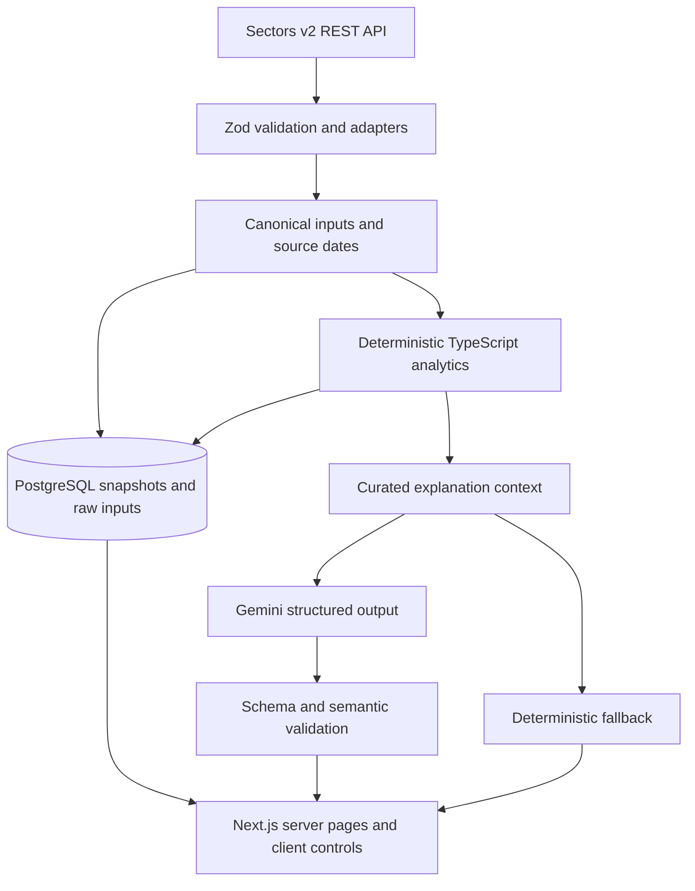

# StockRadar

**Find the signal behind the market.**

StockRadar transforms Sectors data into two independent layers of Indonesian equity research: a multi-factor **Signal Score** and a statistical **Anomaly Score**. A grounded Gemini brief explains calculated evidence; the model never produces scores. Built for **Sectors Hackathon, Track 3 — Market Intelligence**.

Raw financial tables are difficult to synthesize. StockRadar adds peer percentiles, explicit missing-data coverage, transparent weighting, historical Z-scores and sector residuals so a researcher can identify companies worth investigating and inspect why.

## Run the demo

Requirements: Node.js 22.13+, pnpm. No service credentials are needed for explicitly labeled synthetic demo mode.

```sh
pnpm install
```

Copy `.env.example` to `.env.local`, set `DATA_MODE=fixture`, then:

```sh
pnpm dev
```

Open [localhost:3000](http://localhost:3000). The delivered local `.env.local` is already set to fixture mode and is ignored by Git. It is not included in portable source archives. All demo numbers, history, and classifications are synthetic; the company identities are real. The fixed snapshot date is September 18, 2026.

## Product workflows

- **Welcome:** an emerald splash with a subtle radar sweep, keyboard entry and reduced-motion support. It appears once per browser-tab session at the home entry point; `/splash` always previews it. Direct research links remain accessible.
- **Overview:** research-universe summary, strongest measured signals, unusual activity, and source labels.
- **Watchlist:** save and remove companies from the overview, screener or company page; review separate Signal and Anomaly Scores at `/watchlist`. Stored in this browser, synchronized across tabs, with no account or cross-device sync. Clearing browser storage removes the list.
- **Screener:** search, sector/minimum score/coverage filters, sortable ranks, six presets and validated custom weights persisted on the device.
- **Market Radar:** anomaly ranking, primary weighted trigger, signed Z-scores and supported component filters.
- **Stock intelligence:** separate scores, factor decomposition, raw metrics, periods, peer evidence, price/volume charts and an on-demand research brief.
- **Methodology:** formulas, coverage rules, comparison population, limitations and source attribution.

## Architecture



This is a modular monolith. Quantitative functions have no network or LLM dependencies. Live ingestion is an explicit worker/CLI operation; HTTP page requests read complete persisted snapshots. The UI receives normalized results rather than raw Sectors payloads. The database stores original canonical and raw input snapshots to support reproduction. A bounded process cache supplements durable PostgreSQL caching.

Stack: Next.js 16, React 19, strict TypeScript, Tailwind CSS 4, shadcn-style Radix UI primitives, Lucide, Recharts, Zod, Drizzle/Postgres, Google GenAI SDK, Vitest/Testing Library and Playwright. Exact installed versions are locked in `pnpm-lock.yaml`. The shadcn CLI was blocked by a local path permission issue; the small Radix Button and Skeleton source primitives were added manually using the documented composition.

## Live configuration

The default is `DATA_MODE=sectors`. A missing key or missing saved universe produces a configuration/data-unavailable state. It never silently substitutes fixtures.

| Variable | Purpose |
|---|---|
| `DATA_MODE` | `sectors` or explicit `fixture` |
| `SECTORS_API_KEY` | Server-only Sectors API key |
| `SECTORS_API_BASE_URL` | Validated fixed origin, `https://api.sectors.app/v2` |
| `SECTORS_TICKERS` | Explicit research universe, at most 40 validated symbols |
| `DATABASE_URL` | Server-only PostgreSQL/Supabase connection string |
| `GEMINI_API_KEY` | Optional server-only Gemini key |
| `GEMINI_MODEL` | Model selected by the operator; example `gemini-3.5-flash-lite` |
| `NEXT_PUBLIC_APP_URL` | Public application origin; no secret |

The [Sectors data map](docs/sectors-data-map.md) records the verified endpoints, nested fields, units, and transformations. The integration uses report sections `overview,financials,valuation,dividend` and chunks daily requests into windows of at most 90 calendar days. It does not use other financial-data providers. History and financial sections are cached with different TTLs.

The [Gemini design](docs/llm-design.md) links official model, pricing, and structured-output documentation. The selected example model was documented with a Free Tier at implementation; account availability and quotas require live verification. No web-search grounding is enabled. Missing credentials, timeouts, invalid output, or quota exhaustion return a labeled deterministic brief.

For live use, configure the variables locally and in the web host, then:

```sh
pnpm db:migrate
pnpm ingest
pnpm scores
pnpm build
pnpm start
```

Use the same database for ingestion and web serving. The scripts load `.env.local`; a scheduler that injects environment variables can use `pnpm exec tsx --conditions=react-server scripts/ingest.ts`. Ingestion can take several minutes and consume Sectors credits. A cold default 15-company ingestion uses up to 90 HTTP requests before retries; report credit charges can vary by section. Failed refreshes retain the previous complete snapshot with a stale warning. Live page requests never trigger ingestion.

## Methodology summary

Balanced Signal weights are Quality 25%, Growth 25%, Valuation 20%, Momentum 20%, Risk 10%. Each metric uses peer percentiles; missing metrics are excluded with original-weight coverage retained. Signal is unavailable below 60% coverage. Nonpositive P/E and P/B are not ranked as cheap. Higher Risk score means more favorable measured risk characteristics.

Anomaly components compare current volume, return, short-term volatility, and sector-relative return to prior observations. `z = (current − mean) / sample SD`, transformed to `100 × (1 − exp(−abs(z)/2))`. The current observation is excluded from all baselines. The daily source lacks transaction value/frequency, so that proposed component is omitted and remaining weights are normalized. Signal and Anomaly are never combined.

See [exact scoring formulas](docs/scoring-methodology.md) and [limitations](docs/limitations.md). The configured universe is not the whole exchange; price returns are unadjusted and are not total returns. Historical annual valuation ratios are not current TTM multiples.

## Commands and checks

```sh
pnpm lint
pnpm typecheck
pnpm test
pnpm build
pnpm exec playwright install chromium
pnpm test:e2e
```

Playwright starts its own production server in fixture mode. Stop another server on port 3000 first; the suite fails rather than silently reusing a potentially older build. Explicit `PLAYWRIGHT_REUSE_SERVER=1` is available for deliberate interactive testing. It covers the complete overview → screener → stock → brief → radar flow at 1536px and 375px. `PLAYWRIGHT_CHANNEL=chrome` can use an installed Chrome instead of a downloaded browser. Runtime logs and test artifacts are development output; they contain no credentials.

Additional commands: `pnpm db:generate` prepares proposed schema changes for review; `pnpm db:migrate` applies the checked-in ordered SQL files; `pnpm ingest` fetches a complete universe; `pnpm scores` recalculates from saved inputs. Normal tests mock Gemini and Sectors rather than spending provider quota.

## Deployment and handoff

See [verification and acceptance status](docs/verification.md) for the final test results, resolved review findings and remaining live-service checks. Install dependencies explicitly after extraction; run commands do not implicitly reinstall packages.

Target Vercel for Next.js and Supabase PostgreSQL for persistence. See the [deployment runbook](docs/deployment.md) for migration, ingestion, environment, scheduling and live smoke-test steps. A separate scheduler should run ingestion; there is deliberately no public expensive ingestion endpoint.

Authenticated Sectors, Gemini and PostgreSQL were not verified during this build because credentials were not configured. No public deployment has been made. Local fixture tests and successful builds do not satisfy those live acceptance criteria.

Team ownership: Data/Quant owns `lib/sectors` and `lib/analytics`; Backend owns `lib/db`, `lib/cache`, `lib/data`, API routes and jobs; Frontend owns `app` and `components`; AI/Product owns `lib/ai`, methodology and demo materials. See [AGENTS.md](AGENTS.md) for engineering rules and [the three-minute demo script](docs/demo-script.md).
