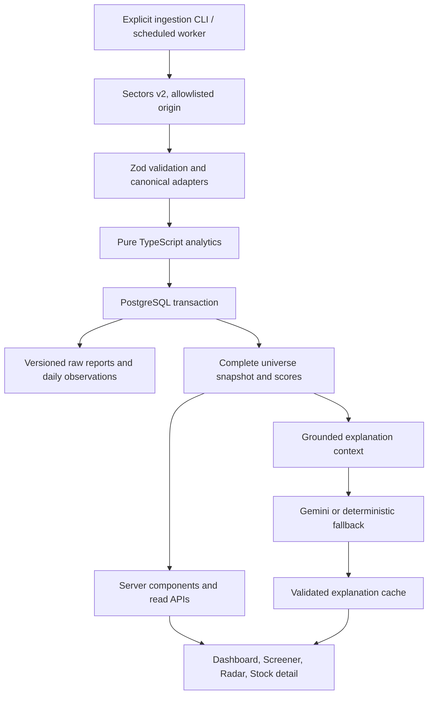

# Architecture

StockRadar is a Next.js modular monolith. The deterministic analytics engine produces independent Signal and Anomaly scores; Gemini only explains the saved findings. Server credentials never enter client components.

## Module boundaries

- `lib/sectors`: fixed-origin HTTP client, response validation, exact documented field mapping, annual growth, date-window splitting. It contains no ranking formulas.
- `lib/analytics`: pure scoring, peer groups, return features and anomaly statistics. Inputs carry their source and reporting periods. The same code handles live and synthetic inputs.
- `lib/data/service.ts`: explicit fixture/live mode selection, complete-universe ingestion, snapshot retrieval and stale fallback. `getDataset()` is the request path; it never calls Sectors. `refreshDataset()` belongs to the CLI/worker only.
- `lib/db`: Drizzle schema, transactional writes, validated snapshot reads and idempotent SQL migrations.
- `lib/cache`: server-only persistent TTL cache with a maximum 600-entry process fallback. Returned values are cloned. Database cache failures produce sanitized operational warnings.
- `lib/ai`: downstream explanation generation and validation. It reads server-owned analyses, never browser-supplied financial facts. Explanation entries share the response cache.
- `components` and `app`: presentation, filtering and ranking controls. Unavailable values remain unavailable; UI source and freshness labels are part of the product.

## Live ingestion and provenance

`DATA_MODE` defaults to `sectors`. Missing credentials produce a configuration error; live mode cannot silently switch to fixture data. `SECTORS_TICKERS` supplies 1–40 canonical four-letter IDX symbols, with `.JK` accepted and normalized. Duplicate symbols are removed. A snapshot is keyed by the sorted universe and analytics version so that changing coverage does not accidentally reuse another ranking universe.

The only upstream origin is `https://api.sectors.app/v2`. The client sends the raw API key in `Authorization`, disables redirects, uses a 10-second timeout and at most three attempts. Network errors, HTTP 429 and HTTP 5xx use exponential backoff capped at five seconds; credential failures are not retried. Response bodies and keys never appear in application errors.

The documented report endpoint returns an object and the daily endpoint an array. The report requests only overview, financials, valuation and dividend sections. Four hundred calendar days of history are split into non-overlapping inclusive windows of at most 90 days, requested sequentially. Ticker identity and dates are checked before caching. History is deduplicated and sorted; null prices are omitted and null volume remains absent. Numeric strings are rejected rather than guessed.

Annual ratios and growth use the latest year appearing in the financial sections; a metric absent in that year is withheld instead of falling back silently to an older period. Annual growth requires adjacent years and a positive prior value. Valuation uses its own latest annual period; nonpositive multiples are unavailable. Raw source dates, every documented/unknown source field, and the entire raw daily response are retained in versioned JSON. Canonical `fetchedAt` identifies the oldest contributing source retrieval; separate `reportFetchedAt` and `marketFetchedAt` preserve each source's retrieval time through cache hits. Market retrieval is the oldest daily chunk. `financialYear` and `valuationYear` identify reporting periods, each historical observation has a market date, and `calculatedAt` records computation. Report responses may be up to 24 hours old and daily responses up to six hours old when assembled from cache.

All companies must finish before one transaction writes companies, versioned raw/canonical snapshots, market observations, scores and the complete dataset. Failure rolls back the whole publication. No partial universe replaces a valid snapshot. A digest of canonical inputs identifies a source snapshot, and scores include the analytics version. Retrying identical inputs upserts existing rows; changed inputs or source retrieval times retain a distinct audit record.

## Database and caching

Tables: `companies`, `fundamental_snapshots`, `market_history`, `signal_scores`, `anomaly_scores`, `dataset_snapshots`, `response_cache`. Market rows use `(ticker, date)`; latest rows may be corrected on ingestion, while versioned raw snapshots retain prior source inputs for reproduction. Complete dataset JSON includes original canonical inputs, formulas' version, calculation timestamps and every component score. Scores recalculated with `pnpm scores` retain original source timestamps.

SQL migrations use a transaction, an advisory lock and `stockradar_migrations` ledger. Tables use PostgreSQL row-level security without anonymous policies. The server must use a trusted database role with access; no Supabase browser client is needed. The default connection pool has three connections and disables prepared statements to work with a transaction pooler.

Sectors cache entries are scoped by a one-way API-key digest and request path. Only validated responses enter the cache and cache hits are revalidated. Reports expire after 24 hours; daily chunks after six hours. Database reads use the expiration index. Process cache entries are bounded and expire on access; they do not survive restarts. Expired persistent cache rows can be removed by the maintenance SQL described in deployment notes.

Snapshots are not TTL-deleted. Source freshness checks six hours for market retrieval and 24 hours for reports. A failed ingestion records a seven-day failure marker; the next successful ingestion clears it. Reads bypass the process cache for this mutable status, and unknown status is treated as stale. If PostgreSQL becomes unavailable, a process that has already read a complete dataset can serve its copy with a stale warning. A cold process cannot recover that copy and shows an unavailable state. Reads also recompute from canonical inputs when history crosses the seven-day market cutoff, withholding aged market factors and anomalies while preserving source times. None of these reads calls Sectors.

## Fixture mode

Explicit `DATA_MODE=fixture` runs without a database or credentials. Fifteen real company identities form three five-company sectors; all values are synthetic. A seeded generator produces 400 calendar days of weekday observations ending 2026-09-18. It does not implement IDX holidays or corporate-action adjustments. Several distinct volume, return and volatility shocks make the separate anomaly components demonstrable. Fixed source and calculation timestamps keep screenshots and tests reproducible. Fixtures never claim to be live market observations.

## Verification limits

Adapter/client, fixture, cache and service behavior are covered by deterministic tests, including sanitized bad credentials, bounded retries, schema mismatch, no silent fixture fallback and no ingestion on reads. Official endpoint contracts were checked against Sectors documentation. No Sectors key or database was supplied for authenticated live connectivity or PostgreSQL migration validation in this environment. Those checks remain deployment prerequisites; mocked HTTP tests are not evidence of live access.
